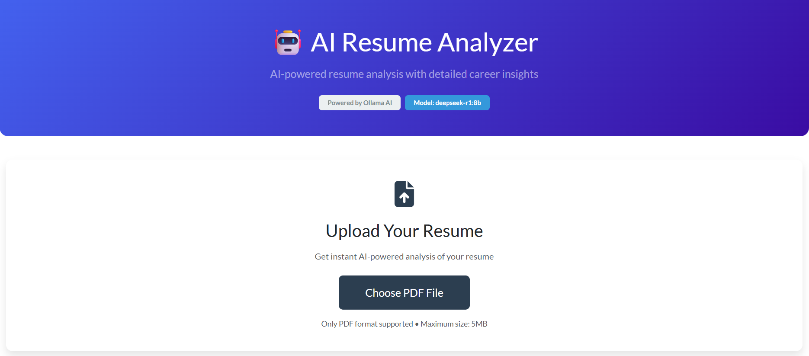
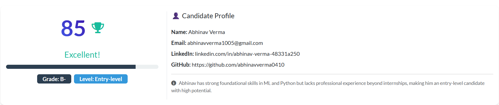
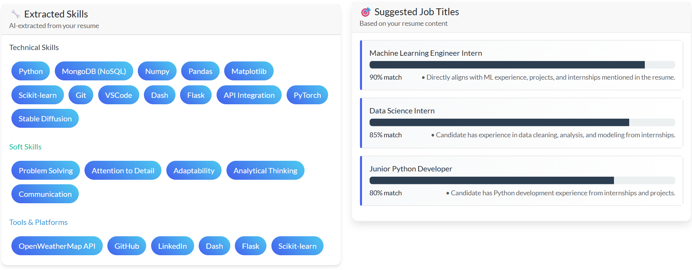
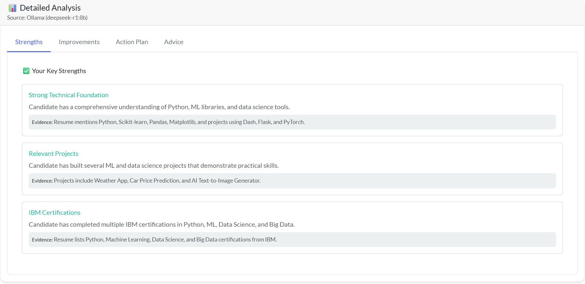

# 🧠 AI Resume Analyzer (Local LLM Powered)

An AI-powered resume analysis and career coaching platform that runs entirely on your local machine using Ollama + DeepSeek.
No OpenAI keys. No cloud APIs. No data leakage.

Built for developers, students, and professionals who want deep resume insights with full privacy.

---

## ✨ Key Features
### 📄 PDF Resume Parsing
- Robust text extraction using PyMuPDF
- Handles real-world resume formats

### 👤 Accurate Candidate Info Extraction
- Smart name detection (not just first line)
- Email, phone, LinkedIn, GitHub extraction

### 🧠 Local LLM Resume Intelligence
- Powered by DeepSeek (via Ollama)
- Zero API cost, zero rate limits

### 📊 Resume Scoring & Grading
- AI-generated score (0–100)
- Letter grade (A–F)
- Experience level detection

### 🧩 Skill Extraction
- Technical skills
- Soft skills
- Tools & platforms
(Only extracted if present — no hallucinations)

### 🎯 Job Role Recommendations
- Confidence-based job title matching
- Evidence-backed reasoning

### 🚀 Actionable Career Coaching
- Strengths & weaknesses
- Resume improvement suggestions
- Personalized career advice

### 🔒 Privacy First
- Everything runs locally
- Resume never leaves your system

---

## 🖥️ Application UI Preview





---

## 🏗️ Tech Stack
| Layer       | Technology                       |
| ----------- | -------------------------------- |
| Frontend    | Dash + Dash Bootstrap Components |
| Backend     | Python                           |
| AI Engine   | Ollama (DeepSeek LLM)            |
| PDF Parsing | PyMuPDF                          |
| UI Styling  | Bootstrap + Custom CSS           |
| Deployment  | Localhost (offline-ready)        |

---

## ⚙️ Requirements
### 1️⃣ Install Ollama

Download from:
👉 https://ollama.com

Verify:
```bash
ollama --version
```

### 2️⃣ Pull DeepSeek Model
```bash
ollama pull deepseek-r1:8b
```
⚠️ Requires ~8–9 GB RAM (recommended 16 GB system)

### 3️⃣ Install Python Dependencies
```bash
pip install dash dash-bootstrap-components pymupdf ollama
```
(Regex, JSON, and OS modules are built-in)

### ▶️ How to Run
```bash
python app.py
```

Then open:
http://localhost:8050

---

## 🖥️ Application Flow
1. Upload resume (PDF)
2. Resume text extracted locally
3. andidate details detected
4. DeepSeek LLM analyzes resume
5. Dashboard displays:
  - Resume score & grade
  - Skills breakdown
  - Job role suggestions
  - Career improvement plan

---

## 📂 Project Structure
```text
AI Resume Analyzer/
│
├── app.py                # Main Dash application
├── uploads/              # Temporary resume storage
├── assets/
│   └── style.css         # Custom UI styling
└── README.md
```

---

## 🎯 Ideal Use Cases
- Students & freshers
- Job seekers
- Resume reviewers
- Career coaches
- AI portfolio projects
- Privacy-conscious users

---

## 📌 Future Enhancements
- Resume vs Job Description matching
- ATS compatibility scoring
- Resume rewriting with local LLM
- Multi-language resume support
- Export feedback as PDF

---

## 👑 Author
### Abhinav Verma
Built with precision and intent
